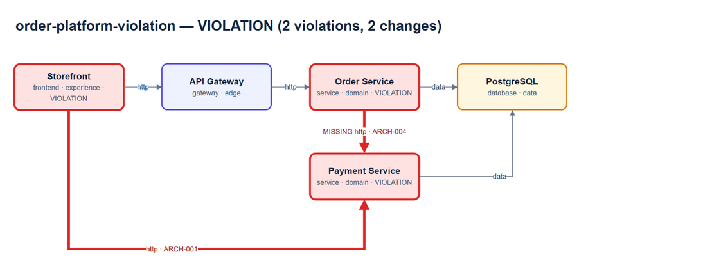
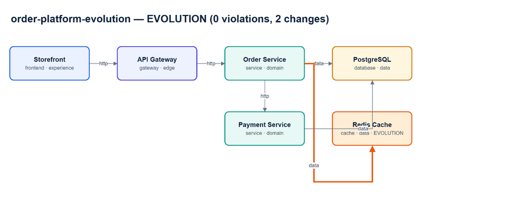

# Architecture conformance demo

These reports compare the expected Order Platform model with two schema-valid observed models.

## Violation report



The observed model introduces `frontend -> payment-service` and removes the required `order-service -> payment-service` edge. ArchSync reports:

- `ARCH-001`: forbidden relationship, shown in red.
- `ARCH-004`: missing required relationship, shown in red with a `MISSING` label.

## Evolution report



The observed model adds Redis and `order-service -> redis`. No deterministic deny/require rule is violated, so ArchSync classifies it as an architecture evolution requiring approval and shows it in orange.

## Regenerate editable reports

```bash
pnpm demo:reports
```

The Mermaid and draw.io files are deterministic and checked by `pnpm phase1:verify`. PNG files are presentation previews exported from draw.io Desktop.

## Conformance exit codes

| Exit code | Classification | Meaning |
| --- | --- | --- |
| 0 | no-impact | No topology/metadata change and no rule violation. |
| 1 | violation | At least one deny or require rule is violated. |
| 2 | usage/input | CLI arguments, report extension or model input is invalid. |
| 3 | evolution | Architecture changed without a deterministic rule violation; approval is required. |

The observed inputs are architecture fixtures. Source-code-to-observed-graph analysis remains Phase 2 work.
